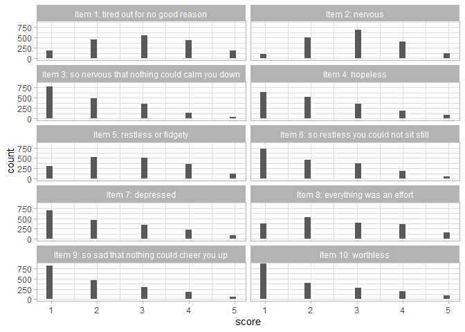
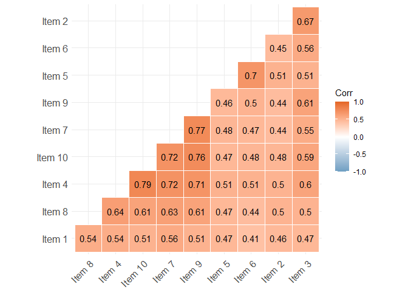
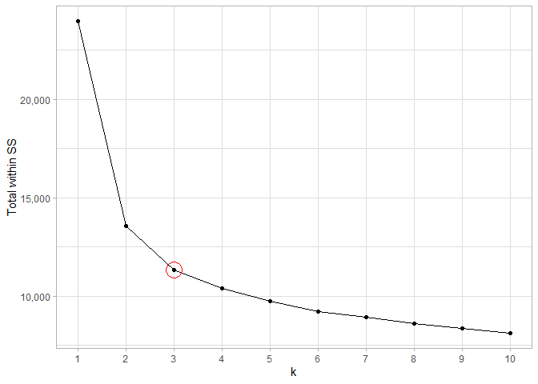
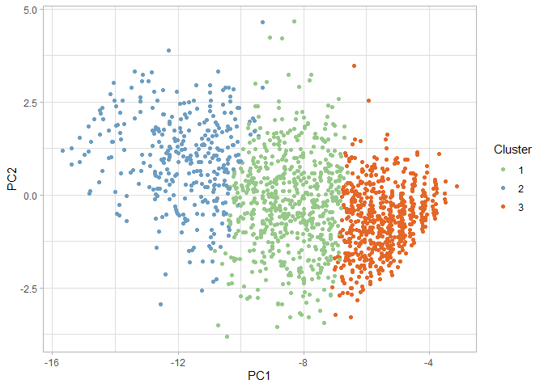
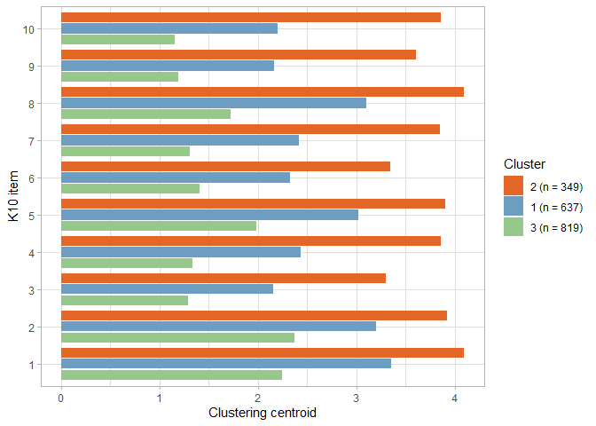

### Mental health k-means clustering

In this analysis, I conduct k-means clustering on data I collected from
over 1800 participants. Each participant completed the Kessler K10
psychological distress scale. This is a 10 item mental distress
(depression and anxiety) scale.

The questions are as follows.

During the last 30 days, about how often did you feel:

1.  tired out for no good reason?
2.  nervous?
3.  so nervous that nothing could calm you down?
4.  hopeless?
5.  restless or fidgety?
6.  so restless you could not sit still?
7.  depressed?
8.  that everything was an effort?
9.  so sad that nothing could cheer you up?
10. worthless?

<br />

Here I load the data and select the variables I need:

``` r
library(tidyverse)
library(janitor)
library(tidymodels)
library(ggcorrplot)
library(glue)

theme_set(theme_light())

data <- read_csv("data/ma_data_3000_headers_removed.csv")

data <- data %>%
    clean_names() %>%
    select(k10_1:k10_10) %>%
    drop_na()
```

<br />

Here is the distribution of the ten K10 items (higher scores indicate
more agreement where 1 = none of the time and 5 = all of the time):

``` r
question_labels <- tibble(item = paste("Item", 1:10),
                          label = c("tired out for no good reason",
                                    "nervous",
                                    "so nervous that nothing could calm you down",
                                    "hopeless",
                                    "restless or fidgety",
                                    "so restless you could not sit still",
                                    "depressed",
                                    "everything was an effort",
                                    "so sad that nothing could cheer you up",
                                    "worthless"))

data %>%
    pivot_longer(everything(), names_to = "item", values_to = "score") %>%
    mutate(item = str_replace(item, "k10_", "Item ")) %>%
    left_join(question_labels, by = "item") %>%
    unite(item, c(item, label), sep = ": ") %>%
    mutate(item = fct_inorder(item)) %>%
    ggplot(aes(score)) +
    geom_histogram() +
    facet_wrap(~item, ncol = 2)
```



<br />

Presumably, we would expect there to be strong correlations between
items on the scale. And indeed, all of the items are correlated, some
quite highly:

``` r
data %>%
    rename_with(~str_replace(.x, "k10_", "Item "), everything()) %>%
    cor() %>%
    ggcorrplot(hc.order = TRUE, type = "lower",
               outline.col = "white", lab = TRUE, 
               colors = c("#6D9EC2", "#FFFFFF", "#E46727"))
```



<br />

Below I conduct k-means clustering trying k = 1 through 10 clusters.

The scree plot below shows that 3 clusters fits the data pretty well,
and there isn’t too much of an improvement in fit by having 4+ clusters.

``` r
k_try <- 1:10

kmeans_results <- tibble(k = k_try) %>%
    mutate(kmeans = map(k, kmeans, x = data)) %>%
    mutate(kmeans_tidy = map_df(kmeans, glance)) %>%
    unnest(kmeans_tidy)

kmeans_results %>%
    ggplot(aes(k, tot.withinss)) +
    geom_line() +
    geom_point() +
    geom_point(data = kmeans_results %>% filter(k == 3),
               aes(k, tot.withinss), color = "red", size = 7, shape = 21) +
    scale_x_continuous(breaks = k_try) +
    scale_y_continuous(labels = scales::comma_format()) +
    theme(panel.grid.minor.x = element_blank()) +
    labs(y = "Total within SS")
```



<br />

Here I used PCA (Principal Components Analysis) to project the 10
dimensional data to two latent dimensions that explain the most
differences in the data:

``` r
custom_colors <- c("#E46727", "#6D9EC2", "#96c989")

k <- 3

best_fit <- kmeans_results$kmeans[[k]]

data %>%
    recipe(~.) %>%
    step_pca(everything(), num_comp = 2) %>%
    prep() %>%
    bake(new_data = NULL) %>%
    mutate(cluster = as_factor(best_fit$cluster)) %>%
    ggplot(aes(PC1, PC2, color = cluster)) +
    geom_point() +
    scale_color_manual(values = rev(custom_colors)) +
    labs(color = "Cluster")
```



<br />

Given that all the items are strongly and positively correlated, the k
means clustering grouped each of the over 1800 participants into a low,
medium, and high levels of psychological distress. I can confirm this by
looking at the average score for each K10 item for each cluster:

``` r
best_fit$centers %>%
    as_tibble() %>%
    mutate(n = best_fit$size) %>%
    mutate(cluster = row_number()) %>%
    pivot_longer(-c(cluster, n), names_to = "item", values_to = "avg") %>%
    mutate(item = str_remove(item, "k10_")) %>%
    mutate(cluster = glue("{cluster} (n = {n})")) %>%
    mutate(cluster = fct_reorder(cluster, avg)) %>%
    mutate(item = fct_inorder(item)) %>% 
    ggplot(aes(avg, item, fill = cluster)) +
    geom_col(position = position_dodge2()) +
    labs(x = "Clustering centroid",
         y = "K10 item",
         fill = "Cluster") +
    scale_fill_manual(values = rev(custom_colors)) +
    guides(fill = guide_legend(reverse = TRUE))
```



<br />

3 clusters fits the data well with most participants having low levels
to medium levels of psychological distress (anxiety and depression).
Participants with the highest levels of psychological distress
constitute the smallest cluster (thankfully).

<br /> <br /> <br /> <br /> <br />
